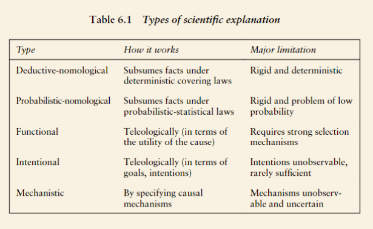

## Comparative (Small-N) Designs
	- require a separate treatment, because they face challenges of a different scale, although not altogether of a different type, from large-N observational research.
	- “Comparative designs” primarily developed in the tradition of comparative politics. Looking at why a government A failed versus gov B
	- cannot rely exclusively on strategies such as randomization and conditioning nor on the law of large numbers
	- the available observations are too few and their diversity is limited
	- The boundary between small- and large-N research is fuzzy and contingent on the state of the art in the scientific field;
	- have no unique approach to causation on their own but combine the strategies of large-N designs with the approach of within-case analysis
		- Identify confirmatory vs disconfirmatory evidence
		- Explore internal vs external validity
	- **Within case analysis**: it provides causal explanations not by studying cross-case patterns, but by evaluating competing hypotheses against numerous pieces of evidence (data) all concerning a single case.
		- within-case evidence can uncover the causal  mechanisms through which causal relationships operate.
		- matches well the goal of accounting for the particular outcomes of the cases, as a particular mode of explanatory analysis
		- questions about alternative explanations that cannot be addressed at the stage of cross-case comparisons can be further scrutinized during the in-depth within-case stage.
	- **Cross-Case Inference:** evaluating competing hypotheses against numerous pieces of evidence (data) all concerning a single case.
	- Designs for explanatory research *need to put the emphasis on different aspects of the logic of inquiry* from its experimental and large-N counterparts.
		- cannot rely on the law of large numbers to reduce measurement error
		- Within-case analysis complimented by careful case selection is critical to mitigating error
		- May be affected by measurement errors: divergence of target and measurement
		- small-N comparisons are just not suitable for the study of very weak and heterogeneous causal relationships.
		- Less effective at ruling out randomness as an expalanation
	- *Estimation of partial average causal effects is less importan*t than building comprehensive explanatory accounts of outcomes, and then for each case being studied. The *interplay of these detailed explanatory accounts and the cross-case patterns emerging when they are juxtaposed to each other* where the real power of small-N comparative research lies.
	- Useful for *inductively* deriving/generating hypotheses and theories (identify causal mechanisms or explain a series of cases)
	- *Deductively* testing narrower hypotheses vs general ones
	- (cross-case inference) Deductive designs:
	  collapsed:: true
		- theoretically motivated, “does mechanism/variable X account for outcome/observation Y”
		- Most Similar Systems Design 1 (MSSD 1):
			- Isolating confounds and main variables
				-
			- E.g. “Federal systems” -> “crisis response capacity”
			- Similarity of systems: key to isolating confounds and emphasise on the main variables
			-  Toy case: main explanatory variable, possible confounds, other causally relevant variable
			- Major issue is identifying similar systems/sufficient amount of cases
			- Run analysis on both cases —> compare significance of variables in both cases
				- If MEV yes —> do not reject null hypothesis
				- If MEV no —> reject null hypothesis
	- (cross-case inference) Inductive designs:
		- Inference made about the possible causal relationship between a set of variables/observations (MSSD 2 and MDSD)
		- collapsed:: true
		    
		  MSSD2
			- Used to analyze and explain empirical puzzles
			- Assists in reasoning from the cases to potential explanations
			- Main explanatory variable is unknown, control and outcome variables are known. What is the explanatory variable?
		- collapsed:: true
		    
		  MSSD:
			- radically different cases with unknown explanatory variables
			- e.g. Heterogenous governance systems producing the same outcomes. Why does this happen?
	- (cross-case inference) Qualitative comparative analysis (QCA):
	  collapsed:: true
		- Medium N inductive approach
		- Qualitative comparative analysis
		- Boolean minimisation (crisp set, multivariate, fuzzy set)
		- Generalisation of paired comparison analysis as done in MSSD1
		- Helps with conjectural causality and allows for the observation of equifinality
			- Shit thats in conjunction with each other + different conjunctive effects lead to X outcomes
		- Helps identify/analyze the necessary and sufficient conditions of a given outcome or outcomes
		- INUS condition: individually insufficient part of a purely sufficient condition
- ## Explanations and Causal Inference
	- Causal statements require a stronger epistemic criterion than descriptive ones:
		- E.g. Football and skin color: categorical factors (player position) are signficant given the overall disparity in colored vs white players
		- Perl ladder of causation
	- **Counterfactual definition of causality**: the effect of an observed factor in the face of static or normal conditions
	- Counterfactuals are approximated, thus are probabilistic. Primarily deal with unobservable phenomena
	- **Correlation v Causation:** mere presence of a factor given an observation does not imply that it has a significant effect
	- **Casual graphs:** constructed via prior lit review to identify key variables, factors and confounds
	- nomological (in its deterministic and probabilistic variants), functional, intentional, and mechanistic causal types of explanation.
		- differ in their underlying explanatory logic and in their primary focus.
	- Types of explanation (simplified):
		- Mechanistic: a sequence of events that link cause and effect
		- Probabilistic: the likeliehood of an outcome given an observed factor
	- Dealing with reverse causation:
		- time series data helps (if X preceedes Y)
		- control for spurrious causation (confounds)
	- **Types of explanation**
		- 
		- **Covering laws (‘deductive nomological)**
		  collapsed:: true
			- An outcome is explained if it can be deductively subsumed under principles having the character of general laws.
				- ohn voted at the last elections by the particular fact that John is rich and the general law that rich people always vote
				- Theories explain why and under what circumstances these laws hold. Laws are more than empirical generalizations and require a certain necessity rather than the existence of mere regularities (which might after all be accidental).
				- Theories explain why and under what circumstances these laws hold. Laws are more than empirical generalizations and require a certain necessity rather than the existence of mere regularities (which might after all be accidental).
			- When scientific laws in the strong sense defined above are avail able, explanation of particular facts is straightforward, according to the deductive nomological model. But when they are not, explanation would appear to be impossible,
			- t best they refer to probabilistic tenden cies rather than strict regularities as would be expected from real laws.
				- hile observations of real life coalition formation generally support this ten dency (although exceptions abound), theories not only fail to posit any necessity to the pattern but actually have a hard time reconciling it with standard collective decision making models (Gamson, 1961; Carroll & Cox, 2007)
			- eductive nomological type of explanation is not very useful for political science research, both because it is (too) deterministic
		- **Probabilistic-nomological explanation**
		  collapsed:: true
			- determinism is too strong a requirement, we can relax it and reformu late laws in probabilistic form
			- it comes with its own set of problems
				- it still needs to be based on something more than empirical generalization:
				- For example, only a small proportion of smokers would develop mouth cancer, but smoking nevertheless would provide a sufficient explanation for many of those who do.
				- political repression might still be a sufficient explanation for the ones that do.
				- an explanation does not have to be deterministic is a valuable one and we shall retain it
		- **Functional explanations**
		  collapsed:: true
			- o put it even more suc cinctly, the consequences of the behaviour are its causes (Stinchcombe,1968).
			  collapsed:: true
				- o the spread of professional bureaucracy in the early modern period can be explained by virtue of the fact that it fulfils a basic need of the state,
				- an be explained by virtue of the fact that it helps organizations perform better
			- here needs to be a causal mech anism that rewards and filters beneficial behaviour or traits in order to make them dominant or prevalent in a population. 
			  collapsed:: true
				- For example, in an ideal market efficient firms survive while the rest perish.
				- selection mechanism is sufficiently ruthless, we could indeed account for the prevalence of a trait by its effects, thus teleologically
			- are other contexts that could potentially support functional explanations in the social sciences
			  collapsed:: true
				- conflicts wipe out unsuccessful states and communities, strife for resources filters efficient from inefficient organizations, individual level traits such as altruism or risk aversion could provide evolutionary advantage.
			- n all these cases, the selection mechanisms are often weak. In other words, there is quite a lot of ‘slack’ (Hirschmann, 1970) that allows subopti mally adapted individuals, communities, or states to survive.
			- f the selection mechanisms are not brutal enough or the rewards strong enough, functional explanations break down.
			- equirement to demonstrate not only that a certain behaviour or trait is beneficial but also that there is a generative mechanism that would make it dominant in a population is often very difficult to satisfy,
		- **Intentional explanations**
		  collapsed:: true
			- Explanations in terms of beliefs coupled with intentions (desires, wants, interests, needs, reasons, and so on) are also teleological and have their part to play in political science analysis.
			- While intuitive, intentional explanations face several challenges.
				- ndividual intentions do not combine in a straightforward way to produce collective outcome
				- intentions are not directly observable, so they are of less explanatory value
				- intentions are seldom, if ever, sufficient for explana tion
			- encompass a wide variety of spe cific approaches to understanding social and political phenomena and provide the basis for a number of particular research methodologies.
		- **Mechanistic explanation**
		  collapsed:: true
			- mechanistic explanation identifies causes and effects and the causal paths linking them. It answers the question how the cause produces the effect by tracing the links of a causal chain or the interactions of the elements of a mechanistic model. 
			  collapsed:: true
				- shift attention from covering laws, be they deterministic or statistical, to mechanisms the operation of which is almost always contingent.
				- not teleological, unlike functional and purely intentional explanations.
				- endorse scientific realism as a grounding philosophy at the expense of both pure empiricism (which rejects the very notion of causality, see below) and radical subjectivism (which rejects the idea that social reality is ‘dense’ enough to support objective causes and effects).
				- do not have to, be specified at the level of individual persons explanations
				- are compatible with statistical
			- **Why its compatible with statistics:** because statistics deals with populations, it does not seem to be able to derive a causal story (etiology) for any single unit within the population
				- even if at the bottom of social reality there is a deterministic process producing each individual level outcome, our imperfect understanding of the causal structure would lead to probabilistic causal relationships at the level of obser vation. T
				- Had we known the full causal structure, no statistical explanations would have been necessary
			- identifies a number of different causal paths through which the cause and the effect are linked, and mediating and moderating vari ables provide ways to operationalize and eventually test these conjec tures.
			- start causal cascades in which the effects propagate simultaneously. But the temporal aspect is not essen tial
			- but we had better zero in on the type that should prove most relevant – causal, and more specifically, mechanistic explanation.
			- here are some compli cations in treating all explanations as causal. 
			  collapsed:: true
				- ifficulty with cover ing laws is that, at least when expressed as equations, laws imply strong relationships but no directionality
				- difficulty with functional explanations is that the effect precedes the cause (reversed temporarily)
				- ifficulty with intentional explanations is that it is unclear, to philosophers at least, whether intentions can ontologically be regarded as proper causes
				-
	- **Collider variables:**
		- Associating the wrong 'causal story' with the relatiionship between two or more variables
		- Colliders: * (X and Y) -*> influenced -> factor Z
		- Descrimination by LEO in the US: minority classification and use of force influence the likliehood of the use of force
		- Theoretically influences any factors related to an observational study
- ## **Experimental design**
	- Blocked randomization: randomize the treatment variable within confounding categories
	- Experimental setting may influence the outcome etc
	- Experiemnts are useful when studying attributes/characteristics that are not randomly assigned. Enabling the controlled randomization of the subjects
	- Require the idenficiation and testing of mechanisms
	- Alternative treatments (ITT vs TOT): varying the treatment to test the strength of the effect (the treatment on the treated)
	- Randomness: operates with both the treatment and control group. Influences both external and internal validity
- ## Theory and Concepts
	-
- ## Types of Research
	-
-