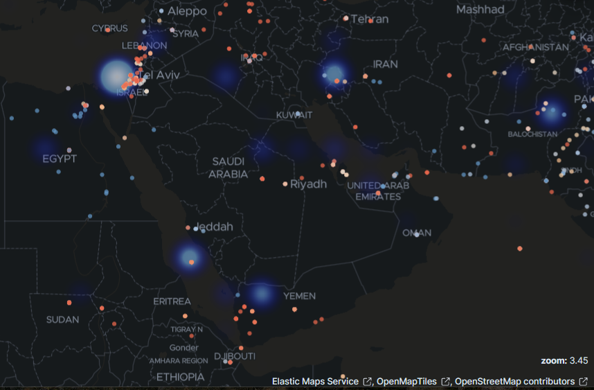
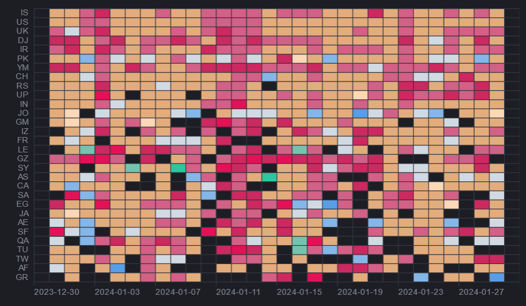

- [Projects Directory](index) [[old-gulf]]
- # The other gulf regional security assessment
	- ## Part 1: Overview
		- ### Regional effects
			- {:height 356, :width 670}
		- ### Implications
			-
		- ### Conflict intensity
			- {:height 356, :width 670}
		- ### Risk Modifiers
			- Intensification/militarisation of Iranian diplomatic tone
			- Declarations of kinetic action by Coalition diplomats
			- Israeli precision strikes beyond its borders
			- Chinese/Russian diplomatic allignment with Iranian statements
			- Indications of disconnect/fragmentation within Coalition members/Coalition narratives
			- Directly contradictory narratives/diplomatic statements made by partners of previous maritime security regime (I.E., Egypt/Djibouti & Prosperity Guardian)
			- Escalation in warfighting platform deployment to region + transfer of weapons between relevant parties
			- Significant increase in cyber activity/targeted attacks
			- Significant call up of "military aged males"
			- Uptick/Downtick in kinetic activity
			- Increase in SOF operations
			- Disconnect/Contradiction between Coalition statements and action taken on part of corporate actors
			- Significant disruption of public services/utilities/defence by cyber actors (i.e., cyber/kinetic nexus)
		- ### Outlook
			-
-
-
- **International Logistics**: Suez Canal/Red Sea/Gulf of Aden (edited) Vessels, industries, vessel flags and registration, general traffic
- **Kinetic maritime operators**: United States Navy, United States Marine Corps, Royal Navy, French Navy, Combined Task Force 153, Bahrain, Canada, Denmark, Greece, Netherlands, Norway, Seychelles, IRGC, Houthi, IDF, Ansar Allah, Indian Navy (edited)
  
  **Known military vessels in region**: HMS Diamond, ENS Alexandria, FS Languedoc, RFA Cardigan Bay, USS Dwight D. Eisenhower, USS Philippine Sea, USS Gravely, USS Stethem, USS Mason, USS Carney, USS Laboon, USS Bataan, USS Carter Hall, USNS Kanawha, USNS Amelia Earhart, Linyi, Urumqi, Dongpinghu, JS Akebono, HMS Lancaster, ESPS Victoria, INS Kochi, INS Kolkata, ROKS Yang Man-Chun, MV Behshad (edited)
- **Known peripheral military vessels in region**: HMS Bangor, HMS Middleton, HMS Chiddingfold, RFA Cardigan Bay, USS Indianapolis, USNS Alan Shepard, USCGC Clarence Sutphin Jr WPC-1147, USCGC John Scheuerman WPC-1146, USCGC Emlen Tunnel WPC-1145, USCGC Glen Harris WPC-1144, USCGC Roboert Goldman WPC-1142, USCGC Charles Moulthrope WPC-1141, INS Trishul, USNS Supply T-AOE 6, USS Florida, USS Gladiator MCM 11, USS Devastor MCM 6, USS Dextrous MCM 13, USS Sentry MCM 3 (edited)
  **Other military vessels of interest**: ITS Virginio Fasan, FGS Hessen, unknown Hellenic Frigate, likely Hydra Class
  
  **Kinetic actors on land**: Houthis, Hamas, Hezbollah, IRGC, Kata'ib Hezbollah/Kataeb Hezbollah, Islamic Resistance in Iraq, Popular Mobilization Forces (PMF), Turkey, Syria, CENTCOM, US Army, Syrian Democratic Forces, Ansar Allah, IDF, Any Western SOF, ISIS (edited)
- **Iraq/Syria AOs**: Al-Qahtaniyah Oil Field, Al-Omar oil field located in Deir ez-Zor Governorate of Syria, Zaynab area in the Damascus countryside, Madinat al-Baath in Quneitra Governorate, Erbil International Airport and Ain al-Asad military base, Erbil province of Iraq